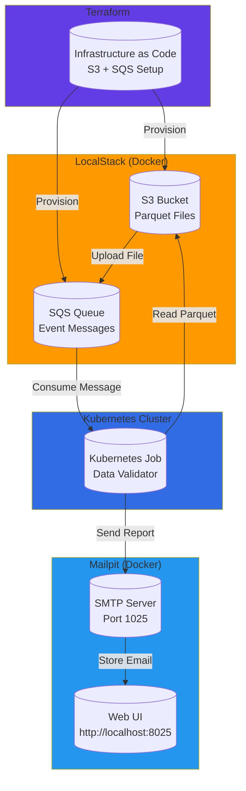
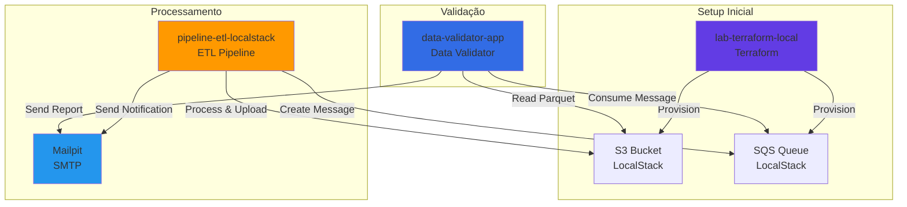

# Data Validator App


## 📋 Visão Geral

O **Data Validator App** é um sistema de validação e processamento de dados que consome arquivos Parquet do Amazon S3 através de filas SQS, realiza análises de qualidade de dados e envia relatórios por e-mail. 

A principal característica deste projeto é que **toda a infraestrutura roda localmente**, utilizando:

- **LocalStack** (Docker) para emular serviços AWS (S3 e SQS)
- **Mailpit** (Docker) para captura e visualização de e-mails
- **Kubernetes** para orquestração de jobs de processamento
- **Terraform** para provisionamento automático da infraestrutura local

Esta abordagem garante um **processo de testes totalmente sem custos**, sem necessidade de conexões externas ou serviços cloud pagos.

## 🏗️ Arquitetura

O sistema segue uma arquitetura baseada em eventos, onde arquivos são processados de forma assíncrona através de filas:



### Fluxo de Processamento

1. **lab-terraform-local** provisiona o bucket S3 e a fila SQS no LocalStack via Terraform
2. **pipeline-etl-localstack** processa arquivos brutos, cria arquivos Parquet e os envia para o **S3**
3. **pipeline-etl-localstack** adiciona uma mensagem à **fila SQS** com o caminho do arquivo processado
4. O **Kubernetes Job** do **data-validator-app** consome a mensagem da fila
5. O validador lê o arquivo Parquet do S3
6. Estatísticas são geradas (total de linhas, valores, médias)
7. Relatório é enviado via **SMTP para Mailpit**
8. E-mails podem ser visualizados na interface web do Mailpit

## 🛠️ Tecnologias Utilizadas

- **Python 3.12** - Linguagem principal
- **boto3** - Cliente AWS para LocalStack
- **pandas** - Processamento e análise de dados
- **pyarrow** - Leitura de arquivos Parquet
- **LocalStack** - Emulação local de serviços AWS
- **Mailpit** - Servidor SMTP local para testes
- **Kubernetes** - Orquestração de containers
- **Terraform** - Infraestrutura como código
- **Docker** - Containerização

## 📦 Pré-requisitos

Antes de começar, certifique-se de ter instalado:

- **Docker** e **Docker Compose** (versão 2.0+)
- **Kubernetes** (Minikube, Kind, ou cluster local)
- **Terraform** (versão 1.0+)
- **Python 3.12+**
- **AWS CLI** (configurado para LocalStack)
- **kubectl** (para gerenciar o cluster Kubernetes)

## 🚀 Instalação e Configuração

### 1. Clone o Repositório

```bash
git clone https://github.com/victorftrdba/data-validator-app.git
cd data-validator-app
```

### 2. Configurar Ambiente Python

```bash
# Criar ambiente virtual
python3 -m venv venv

# Ativar ambiente virtual
source venv/bin/activate  # Linux/Mac
# ou
venv\Scripts\activate  # Windows

# Instalar dependências
pip install -r requirements.txt
```

### 3. Configurar LocalStack

Crie um arquivo `docker-compose.yml` na raiz do projeto (ou use o do projeto de infraestrutura):

```yaml
version: '3.8'
services:
  localstack:
    image: localstack/localstack:latest
    ports:
      - "4566:4566"
    environment:
      - SERVICES=s3,sqs
      - DEBUG=1
      - DATA_DIR=/tmp/localstack/data
    volumes:
      - "./localstack-data:/tmp/localstack"
```

Inicie o LocalStack:

```bash
docker-compose up -d localstack
```

### 4. Configurar Mailpit

Adicione o Mailpit ao `docker-compose.yml`:

```yaml
  mailpit:
    image: axllent/mailpit:latest
    ports:
      - "1025:1025"  # SMTP
      - "8025:8025"  # Web UI
    environment:
      - MP_SMTP_BIND_ADDR=0.0.0.0:1025
      - MP_WEB_BIND_ADDR=0.0.0.0:8025
```

Inicie o Mailpit:

```bash
docker-compose up -d mailpit
```

Acesse a interface web em: http://localhost:8025

### 5. Configurar Terraform

**Nota**: A infraestrutura é provisionada pelo projeto [lab-terraform-local](https://github.com/victorftrdba/lab-terraform-local). 

Para configurar manualmente, crie um diretório `terraform/` com os arquivos de configuração:

```hcl
# terraform/main.tf
terraform {
  required_providers {
    aws = {
      source  = "hashicorp/aws"
      version = "~> 5.0"
    }
  }
}

provider "aws" {
  access_key                  = "test"
  secret_key                  = "test"
  region                      = "us-east-1"
  s3_use_path_style           = true
  skip_credentials_validation = true
  skip_metadata_api_check     = true
  skip_region_validation      = true
  
  endpoints {
    s3  = "http://localhost:4566"
    sqs = "http://localhost:4566"
  }
}

resource "aws_s3_bucket" "data_bucket" {
  bucket = "projeto-cloud-brasil-bucket"
}

resource "aws_sqs_queue" "data_queue" {
  name = "projeto-cloud-brasil-queue"
}
```

Aplique a configuração:

```bash
cd terraform
terraform init
terraform plan
terraform apply
```

### 6. Configurar Variáveis de Ambiente

Crie um arquivo `.env` na raiz do projeto:

```env
AWS_ENDPOINT_URL=http://localhost:4566
S3_BUCKET_NAME=projeto-cloud-brasil-bucket
SQS_QUEUE_NAME=projeto-cloud-brasil-queue
AWS_DEFAULT_REGION=us-east-1
SMTP_SERVER=localhost
SMTP_PORT=1025
EMAIL_FROM=analista@cloudbrasil.com.br
EMAIL_TO=seu-email@exemplo.com
```

### 7. Configurar Kubernetes

Crie um arquivo `k8s/job.yaml`:

```yaml
apiVersion: batch/v1
kind: Job
metadata:
  name: data-validator-job
spec:
  template:
    spec:
      containers:
      - name: validator
        image: data-validator:latest
        env:
        - name: AWS_ENDPOINT_URL
          value: "http://host.docker.internal:4566"
        - name: S3_BUCKET_NAME
          value: "projeto-cloud-brasil-bucket"
        - name: SQS_QUEUE_NAME
          value: "projeto-cloud-brasil-queue"
        - name: SMTP_SERVER
          value: "host.docker.internal"
        - name: SMTP_PORT
          value: "1025"
      restartPolicy: Never
  backoffLimit: 3
```

## 🔗 Integração com Outros Projetos

Este projeto faz parte de um ecossistema maior de projetos locais para desenvolvimento e testes. Ele se integra com outros dois projetos disponíveis no GitHub:

### pipeline-etl-localstack

**Repositório**: [pipeline-etl-localstack](https://github.com/victorftrdba/pipeline-etl-localstack)

**Descrição**: Pipeline ETL que processa arquivos, cria arquivos Parquet, notifica via e-mail e cria mensagens na fila SQS.

**Conexão**: Este projeto é responsável por processar dados brutos, gerar arquivos Parquet e enviá-los para o S3 do LocalStack. Após o processamento, ele cria uma mensagem na fila SQS com o caminho do arquivo, que é então consumida pelo **data-validator-app** para validação e geração de relatórios.

### lab-terraform-local

**Repositório**: [lab-terraform-local](https://github.com/victorftrdba/lab-terraform-local)

**Descrição**: Projeto de infraestrutura como código que automatiza a criação local da infraestrutura AWS usando Terraform.

**Conexão**: Este projeto é responsável por provisionar toda a infraestrutura necessária no LocalStack, incluindo:
- Bucket S3 para armazenamento de arquivos Parquet
- Fila SQS para mensagens de processamento
- Configurações e políticas necessárias

O **data-validator-app** depende desta infraestrutura para funcionar corretamente.

### Fluxo de Integração Completo



## 💻 Uso

### Executar Localmente (Desenvolvimento)

```bash
# Ativar ambiente virtual
source venv/bin/activate

# Executar o validador
python validator.py
```

### Executar via Kubernetes

```bash
# Construir a imagem Docker
docker build -t data-validator:latest .

# Aplicar o job no Kubernetes
kubectl apply -f k8s/job.yaml

# Verificar o status
kubectl get jobs
kubectl logs job/data-validator-job

# Verificar os e-mails no Mailpit
# Acesse: http://localhost:8025
```

### Testar o Sistema

1. **Enviar um arquivo Parquet para o S3**:

```bash
aws --endpoint-url=http://localhost:4566 s3 cp arquivo.parquet s3://projeto-cloud-brasil-bucket/
```

2. **Enviar uma mensagem para a fila SQS**:

```bash
aws --endpoint-url=http://localhost:4566 sqs send-message \
  --queue-url http://localhost:4566/000000000000/projeto-cloud-brasil-queue \
  --message-body '{"s3_path": "s3://projeto-cloud-brasil-bucket/arquivo.parquet"}'
```

**Nota**: Em um fluxo completo, o projeto **pipeline-etl-localstack** faz isso automaticamente após processar os arquivos.

3. **Executar o validador** (localmente ou via Kubernetes)

4. **Verificar os e-mails** no Mailpit: http://localhost:8025

## 📁 Estrutura do Projeto

```
data-validator-app/
├── validator.py          # Script principal de validação
├── requirements.txt      # Dependências Python
├── .env                  # Variáveis de ambiente (não versionado)
├── docker-compose.yml    # Configuração LocalStack e Mailpit
├── k8s/
│   └── job.yaml         # Manifesto Kubernetes
├── terraform/
│   ├── main.tf          # Configuração Terraform
│   └── variables.tf     # Variáveis Terraform
└── README.md            # Este arquivo
```

## ✨ Benefícios da Abordagem 100% Local

### 💰 Custo Zero
- **Sem custos de infraestrutura cloud**: Todos os serviços rodam localmente
- **Sem cobranças de API**: LocalStack emula os serviços AWS gratuitamente
- **Sem limites de requisições**: Teste quantas vezes precisar

### 🚀 Desenvolvimento Rápido
- **Sem dependência de internet**: Funciona completamente offline
- **Setup rápido**: Docker Compose sobe toda a infraestrutura em segundos
- **Iteração rápida**: Mudanças são testadas imediatamente

### 🔒 Segurança e Privacidade
- **Dados locais**: Nenhum dado sai da sua máquina
- **Sem exposição**: Não há risco de vazamento de dados sensíveis
- **Ambiente isolado**: Cada desenvolvedor tem seu próprio ambiente

### 🧪 Testes Confiáveis
- **Ambiente reproduzível**: Terraform garante infraestrutura idêntica
- **Sem variabilidade de rede**: Testes não são afetados por latência externa
- **Debug facilitado**: Logs e erros são mais fáceis de rastrear localmente

### 📚 Aprendizado
- **Experiência prática**: Aprenda AWS, Kubernetes e Terraform sem custos
- **Experimentos livres**: Teste diferentes configurações sem preocupação
- **Portfolio**: Demonstre conhecimento sem depender de serviços pagos

## 🔧 Troubleshooting

### LocalStack não está respondendo

```bash
# Verificar se o container está rodando
docker ps | grep localstack

# Ver logs
docker logs localstack

# Reiniciar
docker-compose restart localstack
```

### Mailpit não recebe e-mails

```bash
# Verificar se a porta 1025 está livre
lsof -i :1025

# Verificar logs
docker logs mailpit
```

### Kubernetes Job falha

```bash
# Ver logs detalhados
kubectl describe job data-validator-job

# Ver logs do pod
kubectl logs job/data-validator-job
```

## 📝 Licença

Este projeto é parte de um conjunto de projetos educacionais e de demonstração.

## 👤 Autor

**Victor FTR DBA**

- GitHub: [@victorftrdba](https://github.com/victorftrdba)
- Repositórios: [Ver todos os projetos](https://github.com/victorftrdba?tab=repositories)

## 🙏 Contribuições

Contribuições são bem-vindas! Sinta-se à vontade para abrir issues ou pull requests.

---

**Nota**: Este projeto é parte de um ecossistema maior de projetos locais para desenvolvimento e testes. Todos os serviços rodam localmente, garantindo um ambiente de desenvolvimento totalmente gratuito e sem dependências externas.

